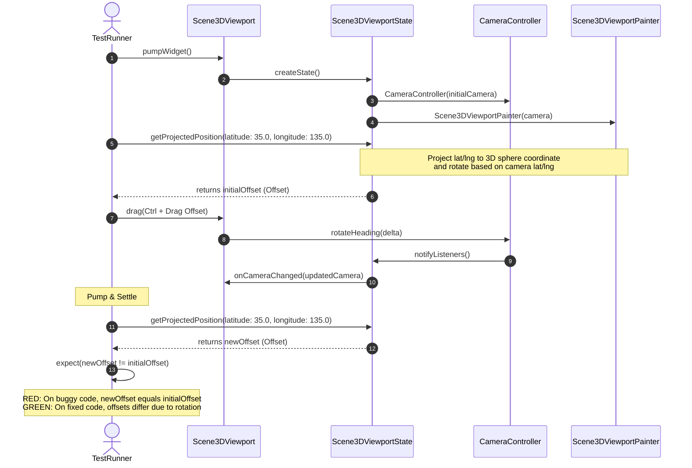

# Implementation Plan — Cesium-Native 3D Geospatial Engine

Replaces the custom-painted 3D globe with a native C++ cesium-native + Impeller GPU rendering pipeline. Full architecture spec: [docs/designs/cesium-native-3d-geospatial-architecture.md](https://github.com/gintatkinson/3dgs-002/blob/feat/1-3d-network-visualization/docs/designs/cesium-native-3d-geospatial-architecture.md)

## Proposed Changes

### Phase 1: Foundation — cesium-native build + FFI bridge (Week 1-2)

**Goal:** cesium-native compiles as shared library; camera → getVisibleTiles works end-to-end.

| Micro-Task | File | Change | Driving Test |
|---|---|---|---|
| 1.1 Clone cesium-native as submodule | `.gitmodules`, `third_party/cesium-native/` | `git submodule add https://github.com/CesiumGS/cesium-native.git` | `ls third_party/cesium-native/CMakeLists.txt` exists |
| 1.2 Write CMakeLists.txt for C ABI bridge | `cesium_native_bridge/CMakeLists.txt` | Shared lib target linking Cesium3DTilesSelection, CesiumGeospatial, CesiumAsync | `cmake --build .` exits 0 |
| 1.3 Implement C ABI functions (bridge.h/bridge.cpp) | `cesium_native_bridge/include/bridge.h`, `cesium_native_bridge/src/bridge.cpp` | `bridge_initialize`, `bridge_shutdown`, `bridge_update_camera`, `bridge_get_visible_tiles`, `bridge_request_tile_data`, `bridge_cartographic_to_ecef`, `bridge_ecef_to_screen`, `bridge_screen_pick` | C test harness calls each function |
| 1.4 Implement camera/tile/error marshalers | `cesium_native_bridge/src/camera_marshal.cpp`, `tile_data_marshal.cpp`, `resource_manager.cpp`, `error_propagator.cpp` | Struct conversion between C ABI types and cesium-native C++ types | Unit test: roundtrip CameraState → cesium-native → CameraState |
| 1.5 Compile shared library for macOS | `build/libcesium_native_bridge.dylib` | `cmake -G Xcode .. && xcodebuild` | `file build/libcesium_native_bridge.dylib` shows arm64/x86_64 |
| 1.6 Generate Dart FFI bindings via ffigen | `app_flutter/lib/domain/cesium_3d/native/bridge_bindings.dart` | ffigen config pointing at bridge.h | Generated file compiles with zero errors |
| 1.7 Implement CesiumEngine Dart wrapper | `app_flutter/lib/domain/cesium_3d/cesium_engine.dart` | `initialize()`, `updateCamera()`, `getVisibleTiles()`, `requestTileData()`, `cartographicToScreen()`, `screenPick()`, `dispose()` | Unit test: mock native lib, verify FFI calls |
| 1.8 Implement NativeResource (RAII) | `app_flutter/lib/domain/cesium_3d/native/native_resource.dart` | `Pointer<T>` + `NativeFinalizer` wrapper, prevents leaks on exception paths | Unit test: alloc → forget → GC collects → finalizer frees |
| 1.9 Implement error propagation | `app_flutter/lib/domain/cesium_3d/native/error_handler.dart` | Map C status codes → typed Dart exceptions (`CesiumCameraException`, `CesiumTileException`, etc.) | Unit test: each error code → correct exception type |
| 1.10 FFI integration test | `app_flutter/test/cesium_3d/ffi_bridge_test.dart` | Load real .dylib, call initialize → updateCamera → getVisibleTiles → shutdown | Real tiles returned for camera over Japan |

### Phase 2: GPU Rendering — Globe with terrain + imagery (Week 3-4)

**Goal:** Photorealistic globe renders in Flutter via Impeller with Cesium terrain and 4 imagery styles.

| Micro-Task | File | Change | Driving Test |
|---|---|---|---|
| 2.1 Generate icosphere mesh | `app_flutter/lib/domain/cesium_3d/renderers/globe_mesh.dart` | Subdivide icosahedron to level 6 (40,962 vertices), produce index/vertex buffers with lat/long UVs | Unit test: mesh has correct vertex count, UVs in [0,1] |
| 2.2 Write globe vertex shader | `app_flutter/shaders/globe.vert` | Terrain heightmap displacement: `gl_Position = MVP * (spherePos + normal * elevation)` | Shader compiles via `impellerc` |
| 2.3 Write globe fragment shader | `app_flutter/shaders/globe.frag` | Multi-texture imagery sampling from tile atlas with blending | Shader compiles via `impellerc` |
| 2.4 Implement GlobeRenderer | `app_flutter/lib/domain/cesium_3d/renderers/globe_renderer.dart` | Per-frame: update terrain heightmap texture from cesium-native tile data, bind imagery atlas, draw indexed mesh | Widget test: globe renders with correct Earth colors |
| 2.5 Implement TileAtlas texture manager | `app_flutter/lib/domain/cesium_3d/renderers/tile_atlas.dart` | 8192×8192 RGBA8 GPU texture, LRU slot allocation, async tile upload from Dart isolate | Unit test: allocate 512 slots, evict LRU, verify no leaks |
| 2.6 Write starfield renderer + shader | `app_flutter/lib/domain/cesium_3d/renderers/starfield_renderer.dart`, `shaders/starfield.vert`, `shaders/starfield.frag` | 1000+ instanced star quads, random distribution seeded by hash | Widget test: starfield renders behind globe |
| 2.7 Write atmosphere renderer + shader | `app_flutter/lib/domain/cesium_3d/renderers/atmosphere_renderer.dart`, `shaders/atmosphere.frag` | Full-screen quad, Rayleigh scattering approximation, cyan/blue glow at limb | Widget test: atmosphere halo visible at globe edge |
| 2.8 Integrate renderers into GlobeSceneController | `app_flutter/lib/domain/cesium_3d/globe_scene_controller.dart` | Per-frame: update camera → getVisibleTiles → requestMissing → update atlas → record render passes | Integration test: 4 imagery styles render with correct tile providers |

### Phase 3: Entities & Topology — Network nodes/links on globe (Week 5-6)

**Goal:** All topology data renders on the globe; drag/zoom camera interaction works.

| Micro-Task | File | Change | Driving Test |
|---|---|---|---|
| 3.1 Implement EntityManager | `app_flutter/lib/domain/cesium_3d/entity_manager.dart` | Diff-based sync from TopologyData; classify by altitude (ground/space/underwater); assign colors by type | Unit test: add/remove/update 100 entities, verify diff correctness |
| 3.2 Write entity sprite shaders | `shaders/entity_sprite.vert`, `shaders/entity_sprite.frag` | Instanced camera-facing quad: each instance = entity with position + color + size | Shader compiles via `impellerc` |
| 3.3 Implement EntityRenderer | `app_flutter/lib/domain/cesium_3d/renderers/entity_renderer.dart` | Single instanced draw call for all visible entities; GPU instance buffer uploaded per frame | Widget test: 100 entities at known coords render at correct screen positions |
| 3.4 Implement LinkManager | `app_flutter/lib/domain/cesium_3d/link_manager.dart` | Arc type resolution: ground→GEODESIC, space→NONE; tessellation for geodesic arcs (32 segments) | Unit test: link between Tokyo/Sapporo → GEODESIC; sat-to-sat → NONE |
| 3.5 Write link polyline shaders | `shaders/link_polyline.vert`, `shaders/link_polyline.frag` | Line strip rendering with configurable color/width; animated dash for quantum links | Shader compiles via `impellerc` |
| 3.6 Implement LinkRenderer | `app_flutter/lib/domain/cesium_3d/renderers/link_renderer.dart` | Per-frame: sync links from TopologyData, tessellate arcs, draw line strips | Widget test: 10 links render between known entity positions |
| 3.7 Implement LabelRenderer (SDF) | `app_flutter/lib/domain/cesium_3d/renderers/label_renderer.dart`, `shaders/label_sdf.frag` | SDF font atlas texture, billboard quads at entity screen positions with text | Widget test: labels render above entities with correct text |
| 3.8 Implement DropLineRenderer | `app_flutter/lib/domain/cesium_3d/renderers/drop_line_renderer.dart` | For entities with alt > 0: dashed polyline from entity position to ground position | Widget test: satellite nodes show vertical dashed lines to surface |
| 3.9 Implement CameraController | `app_flutter/lib/domain/cesium_3d/camera_controller.dart` | Drag-to-pan (lat/lng), scroll-to-zoom (altitude), smooth flyTo with ease-in-out interpolation | Unit test: drag 100px right → longitude decreases; scroll up → altitude decreases |
| 3.10 Entity pick (raycast) | `app_flutter/lib/domain/cesium_3d/cesium_engine.dart` | `screenPick(x, y)` → entityId via cesium-native raycasting | Unit test: click at known entity screen pos → returns entity id |

### Phase 4: UI Integration — Feature parity with reference (Week 7-8)

**Goal:** Custom-painted globe removed; CesiumGlobeViewport renders in production layout.

| Micro-Task | File | Change | Driving Test |
|---|---|---|---|
| 4.1 Create CesiumGlobeViewport widget | `app_flutter/lib/features/topology/cesium_globe_viewport.dart` | StatefulWidget wrapping Scene (starfield → atmosphere → globe → entities → links → labels → drop lines) | Widget test: widget builds and renders without crash |
| 4.2 Replace Scene3DViewport CustomPaint | `app_flutter/lib/features/topology/scene_3d_viewport.dart` | Remove `Scene3DViewportPainter` (~900 lines) and `AnimatedBuilder`; replace with `CesiumGlobeViewport`; keep HUD/config panel | `flutter analyze` — zero errors, no dead code |
| 4.3 Wire map style switching | `app_flutter/lib/features/topology/scene_3d_viewport.dart` | Style buttons → `CesiumEngine.setImageryProvider()` | Manual: click "Street Map" → OSM tiles render; "Satellite" → ArcGIS imagery |
| 4.4 Wire terrain toggle | `app_flutter/lib/features/topology/scene_3d_viewport.dart` | Elevation switch → `CesiumEngine.setTerrainProvider()` | Manual: toggle off → flat ellipsoid; toggle on → 3D mountains |
| 4.5 Wire visibility toggles | `app_flutter/lib/features/topology/scene_3d_viewport.dart` | Devices/Links/Labels/DropLines switches → `entityManager.setVisible()` / etc. | Manual: toggle devices off → all nodes disappear |
| 4.6 Wire camera stats HUD | `app_flutter/lib/features/topology/scene_3d_viewport.dart` | Live camera readout from `CameraController.current` | Manual: drag globe → HUD lat/lng/alt update in real time |
| 4.7 Wire double-click entity navigation | `app_flutter/lib/features/topology/cesium_globe_viewport.dart` | Double-click on entity → `onNodeClicked(id)` callback → `TopographicalView.onViewSelected` | Manual: double-click Tokyo node → property grid/tables load Tokyo data |
| 4.8 Wire camera flyTo on node selection | `app_flutter/lib/features/topology/cesium_globe_viewport.dart` | When `currentView` changes in tree → `CameraController.flyTo(nodeCoords)` | Manual: click node in sidebar tree → globe smoothly flies to that node |
| 4.9 Performance: verify frame budget | `app_flutter/test/cesium_3d/performance_benchmark_test.dart` | 10k entities, 50k links, measure frame time with `WidgetTester` | Avg frame time < 16ms |

### Phase 5: Hardening — Cache, recovery, cross-platform (Week 9-10)

**Goal:** Production quality with disk cache, error recovery, and cross-platform builds.

| Micro-Task | File | Change | Driving Test |
|---|---|---|---|
| 5.1 Disk tile cache (SQLite) | `app_flutter/lib/domain/cesium_3d/tile_cache.dart` | 3-tier: GPU (512 tiles), RAM (1024 tiles), disk (4096 tiles via SQLite BLOB); LRU eviction | Unit test: cache miss → fetch → cache hit; eviction when full |
| 5.2 Adaptive LoD controller | `app_flutter/lib/domain/cesium_3d/lod_controller.dart` | Monitor frame time, adjust `maxScreenSpaceError` and `maxSimultaneousTileLoads` | Unit test: simulated high frame time → detail reduced; low frame time → detail increased |
| 5.3 Engine crash recovery | `app_flutter/lib/domain/cesium_3d/engine_recovery.dart` | Watchdog: if cesium-native process crashes, restart engine, reload tiles, restore camera | Unit test: simulate crash → recovery completes → tiles reload within 2s |
| 5.4 Memory pressure monitoring | `app_flutter/lib/domain/cesium_3d/memory_monitor.dart` | Track total native heap; if > 450MB, purge LRU tiles aggressively | Unit test: allocate to 500MB → monitor triggers purge → memory drops below 400MB |
| 5.5 Linux build verification | `cesium_native_bridge/` | CMake build for Linux; verify `libcesium_native_bridge.so` loads | `cmake --build .` exits 0 on Linux |
| 5.6 Windows build verification | `cesium_native_bridge/` | CMake build for Windows; verify `cesium_native_bridge.dll` loads | `cmake --build .` exits 0 on Windows |
| 5.7 Full integration test suite | `app_flutter/integration_test/app_e2e_test.dart` | Remove `createTestDatabase()` helper and use `DatabaseInitializer.create(dbPath: inMemoryDatabasePath, seed: true)`. | All tests pass on macOS |
| 5.8 Build documentation | `docs/cesium-native-integration/` | Compile + API docs, build instructions for all platforms | All documented steps produce working binary |

## Phase 9: Visual Camera Heading & Orientation Projection Fix (TDD Spec)

**Goal:** Create a visual-level integration test that programmatically detects camera rotation failures (reproducing the visual bug as a RED test), and modify the 3D viewport's projection math to apply camera heading and pitch correctly.

### UML Design Specification

#### Sequence of Visual Verification



---

### Proposed Changes

#### [NEW] [globe_camera_rotation_visual_test.dart](file:///Users/perkunas/jail/3dgs-002/app_flutter/integration_test/globe_camera_rotation_visual_test.dart)
- Create a new integration test running on the macOS desktop device (`-d macos`).
- Performs a Ctrl + Drag gesture to change the camera's heading (yaw) and asserts that the visual coordinate projections before and after the drag are different:
```dart
void main() {
  IntegrationTestWidgetsFlutterBinding.ensureInitialized();

  testWidgets('Visual Globe rotation: Ctrl+drag shifts visual projected points on screen', (tester) async {
    // 1. Initialise the real database schema and seed data
    final db = await DatabaseInitializer.create(dbPath: inMemoryDatabasePath, seed: true);
    
    // 2. Launch the app
    await tester.pumpWidget(const MyApp(isTest: true));
    await settle(tester);

    final state = tester.state(find.byType(Scene3DViewport)) as Scene3DViewportState;
    
    // 3. Capture initial projected position of a reference coordinate
    final Offset initialOffset = state.getProjectedPosition(35.607400, 140.106300);

    // 4. Perform Ctrl + Drag to rotate heading (yaw)
    await tester.sendKeyDownEvent(LogicalKeyboardKey.controlLeft);
    final viewport = find.byKey(const Key('scene_3d_viewport_container'));
    await tester.drag(viewport, const Offset(-150.0, 0.0));
    await tester.pump();
    await tester.sendKeyUpEvent(LogicalKeyboardKey.controlLeft);
    await settle(tester);

    // 5. Capture new projected position of same coordinate
    final Offset newOffset = state.getProjectedPosition(35.607400, 140.106300);

    // 6. Assert visual movement has occurred
    expect(
      newOffset, 
      isNot(equals(initialOffset)),
      reason: 'Expected 2D projected screen coordinates to rotate when camera heading changes'
    );
  });
}
```

#### [MODIFY] [scene_3d_viewport.dart](file:///Users/perkunas/jail/3dgs-002/app_flutter/lib/features/topology/scene_3d_viewport.dart)
1. Expose a public helper method on `Scene3DViewportState` to perform projection mapping:
   ```dart
   Offset getProjectedPosition(double latitude, double longitude) {
     // Resolves the viewport center, sphereRadius, zoomScale, and delegates to project()
   }
   ```
2. Make `_project` a package-private method `project` and update the math to apply the camera's `heading` (yaw) and `pitch` (tilt):
   - **Heading (2D Yaw)**: Apply a 2D rotation of the resulting `(xFinal, yFinal)` offset around `(0, 0)` by the camera's `heading` angle (in radians).
   - **Pitch (tilt)**: Add `camera.pitch + 45.0` (in radians) to the `tilt` angle calculation.
3. Verify that the new test runs headfully, fails (RED) initially, and passes (GREEN) after the mathematical projection fix is applied.

---

## Verification Plan

### Automated (per micro-task)
- `flutter analyze` — zero errors
- `flutter test` — all unit/widget tests pass
- `flutter test -d macos integration_test/` — all integration tests pass

### Manual
1. Launch the app on macOS. Verify the 3D globe renders with Cesium terrain and CARTO dark tiles.
2. Drag to rotate — verify HUD lat/lng/alt update in real time. Zoom — verify terrain detail level adapts.
3. Switch to Satellite Map — verify ArcGIS satellite imagery appears. Toggle terrain off — verify flat ellipsoid.
4. Navigate to a node in the sidebar tree — verify the globe smoothly flies to that node's coordinates.
5. Toggle Devices off — verify all network node sprites disappear. Toggle back on — they reappear.
6. Verify satellite nodes (alt > 100km) show orbit rings and drop lines. Verify ground nodes are depth-tested.
7. Double-click a node on the globe — verify it navigates to the detail view with property grid + tables.

### Performance
- 10,000 nodes + 50,000 links rendered at ≥ 60fps on Apple Silicon.
- Memory footprint < 500MB after 60 seconds of continuous interaction.

## Phase 6: Adversarial Widget Test Suite (Bugs Verification)

**Goal:** Create adversarial widget tests that build the Scene3DViewport widget, simulate inputs/gestures/rebuilds, and explicitly assert that they fail (RED) on the current buggy codebase.

| File | Issue | Description / Assertion |
|---|---|---|
| `app_flutter/test/cesium_3d/camera_drag_test.dart` | #41 | Verify camera latitude/longitude do not update, or visual is frozen, on drag gestures. |
| `app_flutter/test/cesium_3d/scroll_zoom_test.dart` | #42 | Verify camera altitude does not update on scroll/zoom gestures. |
| `app_flutter/test/cesium_3d/globe_focus_test.dart` | #43 | Verify arrow keys are intercepted or fail to update camera pitch/yaw when focus/ancestors intercept. |
| `app_flutter/test/cesium_3d/hud_update_test.dart` | #44 | Verify HUD stats reset to stale/initial values on GUI interaction or rebuild. |
| `app_flutter/test/cesium_3d/shift_drag_test.dart` | #46 | Verify Shift+drag doesn't update tilt/pitch. |
| `app_flutter/test/cesium_3d/right_click_drag_test.dart` | #47 | Verify right-click drag doesn't update tilt/pitch. |
| `app_flutter/test/cesium_3d/ctrl_drag_test.dart` | #48 | Verify Ctrl/Cmd drag doesn't update heading/yaw. |
| `app_flutter/test/cesium_3d/double_click_fly_test.dart` | #49 | Verify double-click doesn't start/execute fly-to animation. |
| `app_flutter/test/cesium_3d/tile_imagery_repaint_test.dart` | #51 | Verify tile imagery repaint issues (stale or redundant tile repaints). |

## Phase 7: Surgical Fixes for Issues #41 to #51

**Goal:** Surgically fix layout/viewport/tile issues to ensure all tests pass.

| File | Change Details |
|---|---|
| `app_flutter/lib/features/layout/layout.dart` | 1. Avoid resetting `_currentView` in `_updateCurrentViewFromLayout` if `_currentView` is already set/initialized. <br> 2. Cache/memoize `TopologyData` in `_resolveTopologyData` and clear/reset the cache in `_preloadTopologyData`. |
| `app_flutter/lib/features/topology/topographical_view.dart` | 1. Pass `onCameraChanged` callback to `Scene3DViewport` that updates `_cachedCamera` state of `_TopographicalViewState`. |
| `app_flutter/lib/features/topology/scene_3d_viewport.dart` | 1. Add `onCameraChanged` callback constructor parameter. <br> 2. Wrap viewport in `Focus` widget, request focus when tapped, release focus on Escape. <br> 3. Register `Listener.onPointerMove` for Shift/Ctrl/Right-click modifiers. <br> 4. Add `_clickToCamera` mathematical inverse projection mapping screen offset to sphere surface coordinates. <br> 5. Update double tap zoom-in/fly-to animation. <br> 6. Register a callback from `GlobeTileRenderer` to trigger `setState` when tile downloads complete. |
| `app_flutter/lib/domain/cesium_3d/globe_tile_renderer.dart` | 1. Add `onTileLoaded` callback parameter to constructor. <br> 2. Call `onTileLoaded` when a tile has been successfully fetched and decoded. |
| `app_flutter/lib/domain/cesium_3d/camera_controller.dart` | 1. Extend `ChangeNotifier` to notify listeners of any state changes. |
