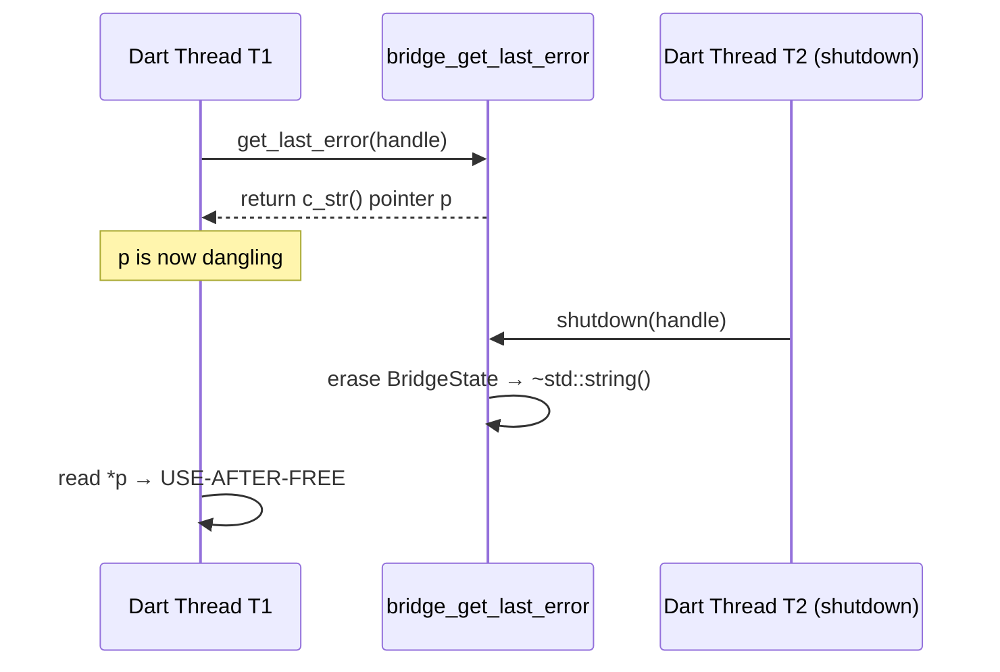

<!-- Copyright 2026. All rights reserved. -->

---
name: adversarial-code-auditor
description: "Pre-emptive adversarial audit of existing code against four correctness risk pillars: memory safety, resource lifecycle, concurrency correctness, and test integrity. Use when you have a cluster of high-risk defects (UAF, double-free, GPU leaks, async races, brittle tests) and need systematic static-analysis-style review before symptoms manifest. NOT for runtime bugs (use debug-protocol) and NOT for spec-to-code gaps (use spec-implementation-auditor)."
compatibility: "Requires gh CLI and git. Works with any agent runtime that supports subagent dispatch."
metadata:
  title: "Adversarial Code Auditor (Correctness Risk Pillars)"
  category: auditing
  risk: low
  source: custom
  version: "1.2"
---

# Adversarial Code Auditor

## Architecture: Two-Role Separation (Proven)

Subagents audit and produce output. Coordinator files everything via `gh`. Subagents cannot run `gh` (tested 0/4 successful dispatches). The working pattern from 23 completed audits:

```
Coordinator (you)
  |
  +-> Auditor Subagent 1  ->  returns issue bodies (audit only)
  +-> Auditor Subagent 2  ->  returns issue bodies (audit only)
  +-> Auditor Subagent N  ->  returns issue bodies (audit only)
  |
  +-> You run gh --body-file for every finding (filing is always coordinator)
```

| Role | Scope | Proven? |
|------|-------|---------|
| **Auditor Subagent** | Read file, audit through pillar lens, produce 7-section bodies | 23/23 successful |
| **Coordinator** | Scope clusters. Dispatch auditors. Write bodies to temp files verbatim. Run `gh issue create --body-file` / `gh issue comment --body-file`. | 27 new issues + 43 comments filed |

---

Use this skill to perform pre-emptive adversarial review of source files identified as belonging to high-risk correctness clusters: **memory safety, resource lifecycle, concurrency correctness, and test integrity**. This is a static-review skill — it reasons about code as written, not about runtime behavior. For dynamic debugging of reproducible defects, use `debug-protocol`.

## When to Invoke

- A cluster of related high-risk defects exists (e.g., 5+ open FFI memory bugs in related source files).
- The defects are static/fundamental in nature (UAF, double-free, missing dispose, racy state mutation, non-isolated tests) — not transient runtime symptoms.
- You want to get ahead of the backlog by auditing the correctness of code before symptoms escalate.

## When NOT to Invoke

- The issue is a single, reproducible runtime bug → use `debug-protocol`.
- The issue is a spec-to-code gap (behavior specified but not implemented) → use `spec-implementation-auditor`.
- The issue is a new feature implementation → use `feature-driven-implementation`.

---

## The Four Risk Pillars

Every audit subagent operates through one of these four lenses, weighted by the target cluster:

### 1. Memory Safety (FFI / Native Bridge)
- Double-free, use-after-free, dangling pointers
- Buffer overflows, signed/unsigned wrap
- C++ exception propagation across FFI boundaries
- Native resource finalizer correctness (NativeFinalizer, reference counting)
- Mutex/pointer lifetime in async callbacks

### 2. Resource Lifecycle (GPU / Image / Memory)
- Missing `dispose()` on GPU resources (`ui.Image`, textures, framebuffers)
- Tile/cache eviction correctness under capacity pressure
- Synchronous I/O on UI thread (file reads, heavy parsing)
- GC allocation churn in render/update hot paths

### 3. Concurrency Correctness (Async Races / ViewModel State)
- `ChangeNotifier` disposal-after-notify races
- Unchecked async type-loading races (multiple futures for same key)
- State mutation from `build()` or other synchronous contexts
- Watch/subscription lifecycle against widget disposal

### 4. Test Integrity (Isolation / Reliability)
- FFI/DB-dependent unit tests (should use mocks/stubs)
- `sleep`/`Future.delayed` loops causing flakiness
- Bare `assert()` instead of `expect()` in test functions
- Missing test suite wrappers (`testWidgets` vs raw `test`)
- Duplicated test fakes/stubs across suites

---

## Step-by-Step Workflow

### Step 0 — Pre-flight: Cluster Scoping (Coordinator)

Before dispatching auditors, scope the target cluster:

1. **Query the tracker** for all open issues labeled `bug`:
   ```bash
   gh issue list --limit 1000 --state open --label bug --json number,title,labels,body
   ```
2. **Classify each issue** into one or more of the four risk pillars based on title/body keywords.
3. **Extract file:line references** from each issue body. If an issue body lacks file paths, skip it for the audit — static review needs target files.
4. **Build a per-file hit list**: deduplicate and group by source file. Rank by issue count (most-referenced files first).
5. **Select the target pillar** — if the user specified one, use it. Otherwise, audit the highest-density pillar.

**Gate:** Produce a scoping summary with the target pillar, file hit list, and issue count. Wait for human authorization (`PROCEED`) before continuing to Step 1.

### Step 1 — Per-File Adversarial Audit (Auditor Subagents)

For each source file in the hit list:

**A. Dispatch a fresh isolated Auditor Subagent** with ONLY:
- The file path (subagent reads the file itself)
- The target risk pillar lens (one of the four above)
- The full 8-dimension review framework (below)
- Project conventions (from `.pipeline/constitution.md`, language-specific rules from the active implementation profile)
- A strict instruction: **Read the file. Audit it. Do NOT modify anything. Do NOT create issues. Do NOT run `gh`.** The subagent's ONLY output is the set of complete, ready-to-file issue bodies.
- **Existing review docs** for context (e.g., `docs/reviews/review_cpp_bridge.md`) — if they exist.

**B. Auditor Subagent executes the 8-dimension adversarial review:**

#### 1) Context Understanding
- What is the purpose of this code? (From file path, class names, imports)
- What problem does it solve?
- What are its callers and callees?

#### 2) Correctness Analysis (weighted by risk pillar)
- **Memory Safety pillar weight: HIGH.** Check every raw pointer dereference, every `Pointer.fromFunction`, every `malloc`/`calloc`/`free` pair, every `NativeFinalizer` registration, every FFI string conversion for UAF risk.
- **Resource Lifecycle pillar weight: HIGH.** Check every class for `dispose()`, every `ui.Image` creation for matching disposal, every cache map for eviction-on-write, every `File.readAsStringSync` call.
- **Concurrency pillar weight: HIGH.** Check every `notifyListeners()` for post-disposal risk, every async factory for idempotency, every `build()` override for state mutation.
- **Test Integrity pillar weight: HIGH.** Check every test file for `import 'package:flutter_test/flutter_test.dart'`, absence of `sleep`/`Future.delayed`, presence of `expect()` over `assert()`, correct test wrapper functions.

#### 3) Security Review
- Input validation: Is data crossing FFI/layer boundaries validated?
- Data exposure: Are secrets, tokens, or keys exposed in logs or error messages?
- Injection: Are query strings or native calls constructed from unsanitized input?

#### 4) Performance Considerations
- **Memory Safety:** Are allocations paired with deallocations on all code paths (including error returns)?
- **Resource Lifecycle:** Are cache eviction policies correct under capacity pressure? Is sync I/O on the right thread?
- **Concurrency:** Are locks/guards scoped to minimize contention?

#### 5) Code Quality & Readability
- Are variable and function names intention-revealing?
- Is the code consistent with the project's naming and formatting conventions?
- Are there dead code blocks, commented-out sections, or placeholder stubs?

#### 6) Architecture & Design
- Does the code follow the Clean Architecture pattern from the implementation profile?
- Are repository/adapter boundaries intact (no persistence SDK imports in UI)?
- Are cross-layer dependencies pointing in the correct direction?

#### 7) Testing
- Is there test coverage for the code in this file?
- Do existing tests cover the risk-pillar scenarios (disposal, error paths, FFI boundary conditions)?
- Are tests isolated from real databases, network, and FFI?

#### 8) Documentation
- Are public APIs documented (JSDoc/TSDoc or DartDoc)?
- Are UML traceability tags present (`@realizes UML::ClassName::operationName`)?
- Are complex algorithms explained?

**C. Auditor Subagent output — for each Critical and Important finding, produce a complete, self-contained issue body:**

```
ISSUE_TITLE: [AUDIT] [File name]: [Brief finding description]

ISSUE_BODY:
## 1. Context and References
- **File**: `path/to/file.ext:line-line`
- **Pillar**: [Memory Safety | Resource Lifecycle | Concurrency | Test Integrity]
- **Symptom**: Observable failure caused by this defect

## 2. Root Cause Analysis (5 Whys)
1. **Why ...?** Because ...
2. **Why ...?** Because ...
3. **Why ...?** Because ...
4. **Why ...?** Because ...
5. **Why ...?** Because ...

## 3. Correctness Analysis
[Detailed explanation of WHY the defect is a defect — trace the data flow, identify the invariant being violated, explain the failure mode in concrete terms. Reference the actual source code lines and the 8-dimension review that revealed this finding.]

## 4. UML Diagrams (when applicable)
[Mermaid classDiagram, sequenceDiagram, or stateDiagram-v2 if it clarifies the defect's mechanics.]

## 5. Affected Callers / Downstream Impact
- [Caller 1] — [how it triggers or is affected by this defect]
- [Caller 2] — ...

## 6. Proposed Correction
[Code snippet showing the fix]

## 7. Relationship to Existing Issues
- **Confirms known issue** [#NNN] — if this finding is already tracked
- **Extends** [#NNN] — if this adds new dimensions to a known issue
- **Discovered in audit** — if this is a new finding

## Audit Source
Adversarial [Pillar] Audit — `docs/audits/adversarial-audit-[pillar]-[YYYY-MM-DD].md`
```

Each issue body MUST include all 7 sections. The Output MUST be clearly delimited with `ISSUE_TITLE:` and `ISSUE_BODY:` markers so the Issue Filer can parse them.
- **Severity**: Critical | Important | Suggestion | Nitpick
- **Location**: `path/to/file.dart:123`
- **Issue**: Clear description of the problem
- **Pillar**: [Memory Safety | Resource Lifecycle | Concurrency | Test Integrity]
- **Suggestion**: Specific recommendation for remediation
```

For Suggestions: produce a comment body with the same level of detail, delimited with `COMMENT_FOR_ISSUE: #NNN` and `COMMENT_BODY:`.

**D. Auditor Subagent returns:** All issue bodies and comment bodies for its file, clearly delimited. The subagent does NOT create issues — it only produces the text.

### Step 1.E — Coordinator Files Findings

After ALL auditor subagents return:

1. Write each auditor's complete output to `/tmp/audit_output_N.txt` verbatim.
2. For each `ISSUE_TITLE:` / `ISSUE_BODY:` pair:
   ```bash
   cat > /tmp/gh_body.md << 'ENDOFFILE'
   [paste ISSUE_BODY exactly as auditor returned — no editing]
   ENDOFFILE
   gh issue create --repo gintatkinson/3dgs-002 --title "[exact ISSUE_TITLE]" --label "bug" --body-file /tmp/gh_body.md
   ```
3. For each `COMMENT_FOR_ISSUE: #N` / `COMMENT_BODY:` pair:
   ```bash
   cat > /tmp/gh_comment.md << 'ENDOFFILE'
   [paste COMMENT_BODY exactly as auditor returned]
   ENDOFFILE
   gh issue comment N --repo gintatkinson/3dgs-002 --body-file /tmp/gh_comment.md
   ```
4. **HARD CONSTRAINT:** The coordinator MUST NOT edit, summarize, truncate, or rewrite auditor output. Verbatim only. Char count verification after file write.

### Step 2 — Cross-Reference Deduplication (Coordinator)

After filing:

1. **Collect all filed issue URLs** from `gh issue create` output.
2. **Check for duplicates** — same root cause in multiple files. For duplicates, close extras and link to canonical issue.
3. **Cross-reference across pillars** — add comments linking related findings across files.

### Step 3 — Aggregate Risk Report (Coordinator Subagent)

Dispatch a final fresh subagent to produce the aggregate report:

```markdown
# Adversarial Audit Report — [Pillar(s)] — [Date]

## Scope
- Risk pillar(s) audited: [list]
- Source files audited: N
- Open issues in cluster before audit: M
- New issues filed: P

## Findings by Severity
- Critical: X
- Important: Y
- Suggestion: Z

## Findings by Pillar
- Memory Safety: A
- Resource Lifecycle: B
- Concurrency: C
- Test Integrity: D

## Per-File Summary
| File | Critical | Important | Suggestion | Nitpick | New Issues |
|---|---|---|---|---|---|
| `src/ffi/bridge.dart` | 3 | 2 | 0 | 1 | #142, #143, #144 |
| ... | | | | | |

## Cross-Cutting Patterns
- [Pattern 1: description, files affected, canonical issue]
- [Pattern 2: ...]

## Recommended Remediation Priority
1. [Highest-priority finding — block all other work]
2. [...]
```

Save the report to `docs/audits/adversarial-audit-<pillar>-<YYYY-MM-DD>.md`.

### Step 4 — Back-Propagation Decision

After the audit completes:
- If the findings expose a gap in the pipeline tooling or skills (e.g., a class of defect the existing skills cannot catch), this skill itself should be proposed to the upstream `gintatkinson/digital-pipeline-repo`.
- File an upstream issue:
  ```bash
  gh issue create \
    --repo gintatkinson/digital-pipeline-repo \
    --title "Skill Proposal: adversarial-code-auditor (Correctness Risk Pillars)" \
    --body "[Summary of results from pilot audit, signal quality, and rationale for inclusion]" \
    --label "enhancement"
  ```

---

## Persistence Rules
- Each file audit MUST use a fresh subagent — do not reuse or combine contexts.
- Do NOT skip or combine pillars — audit one pillar at a time for signal clarity.
- Every Critical and Important finding MUST be filed as a GitHub issue.
- The coordinator MUST NOT perform file audits itself — scope, dispatch, file, verify.
- **VERBATIM MANDATE (HARD CONSTRAINT):** Coordinator writes auditor output to temp file and passes to `gh --body-file` without editing, summarizing, or rewriting. If the coordinator touches content, the audit is invalid.
- Coordinator verifies char count after file write. If count mismatches, re-read auditor output and retry.

## Audit Checklist
- [ ] Step 0: Cluster scoped, file hit list built, pillar selected, human authorization received
- [ ] Step 1: All files audited by isolated subagents with full 7-section issue bodies
- [ ] Step 1.E: Coordinator wrote auditor output to temp files verbatim and ran `gh --body-file`
- [ ] Step 1.E: Coordinator verified each filed issue body char count matches auditor output
- [ ] Step 2: Cross-reference deduplication complete
- [ ] Step 3: Aggregate risk report saved to `docs/audits/`
- [ ] Step 4: Back-propagation decision made (upstream proposal)

---

## How to Run This Skill

1. **Phase 0:** Query open bugs. Classify into pillars. Build file hit list. Present scoping summary. Wait for PROCEED.

2. **Phase 1:** For each file, copy the pillar-specific prompt template above. Replace `[FILE_PATH]`, `[REVIEW_DOC_PATH]`, `[ISSUE_NUMBERS]` with real values. Dispatch auditors in batches of up to 6 in parallel. Collect outputs.

3. **Phase 1.E:** For each finding in auditor output, write body to temp file verbatim, then:
   ```bash
   gh issue create --repo gintatkinson/3dgs-002 --title "[title]" --label "bug" --body-file /tmp/gh_body.md
   ```
   Or for comments:
   ```bash
   gh issue comment N --repo gintatkinson/3dgs-002 --body-file /tmp/gh_comment.md
   ```
   Never edit auditor output before filing. Char count must match.

4. **Phase 2:** Cross-reference for duplicates. Link related findings across files.

5. **Phase 3:** Produce aggregate report.

6. **Repeat** for remaining pillars. Stop only when all open bugs have audit coverage or human intervenes.

### Memory Safety Auditor Prompt

```
Auditor. Read file: [FILE_PATH]. Also read [REVIEW_DOC_PATH] if it exists.
Pillar: Memory Safety. 8-dimension review. Weight Correctness HIGH.

KNOWN ISSUES for this file: [ISSUE_NUMBERS]. Read: gh issue view [N1 N2 N3] --repo gintatkinson/3dgs-002 --json body

Focus: double-free, UAF, dangling pointers, exception safety at extern "C", malloc/free pairing, NativeFinalizer correctness, mutex lifetime in async callbacks, string lifetime across FFI.

Produce 7-section issue bodies. Confirms/Extends -> comment. Discovered -> new issue.
Return output. PROCEED
```

### Resource Lifecycle Auditor Prompt

```
Auditor. Read file: [FILE_PATH]. Also read [REVIEW_DOC_PATH] if it exists.
Pillar: Resource Lifecycle. 8-dimension review. Weight Correctness HIGH.

KNOWN ISSUES for this file: [ISSUE_NUMBERS]. Read: gh issue view [N1 N2 N3] --repo gintatkinson/3dgs-002 --json body

Focus: missing dispose() on GPU resources, cache eviction correctness, sync I/O on UI thread, GC allocation churn in paint/build, repaint storms, widget tree depth, BackdropFilter overhead.

Produce 7-section issue bodies. Confirms/Extends -> comment. Discovered -> new issue.
Return output. PROCEED
```

### Concurrency Auditor Prompt

```
Auditor. Read file: [FILE_PATH]. Also read [REVIEW_DOC_PATH] if it exists.
Pillar: Concurrency Correctness. 8-dimension review. Weight Correctness HIGH.

KNOWN ISSUES for this file: [ISSUE_NUMBERS]. Read: gh issue view [N1 N2 N3] --repo gintatkinson/3dgs-002 --json body

Focus: ChangeNotifier disposal-after-notify, async type-loading races, state mutation in build(), watch/subscription lifecycle, TOCTOU on shared state, re-entrant async methods, missing _disposed guards.

Produce 7-section issue bodies. Confirms/Extends -> comment. Discovered -> new issue.
Return output. PROCEED
```

### Test Integrity Auditor Prompt

```
Auditor. Read file: [FILE_PATH]. Also read [REVIEW_DOC_PATH] if it exists.
Pillar: Test Integrity. 8-dimension review. Weight Correctness HIGH.

KNOWN ISSUES for this file: [ISSUE_NUMBERS]. Read: gh issue view [N1 N2 N3] --repo gintatkinson/3dgs-002 --json body

Focus: FFI/DB-dependent tests requiring mocks, sleep/Future.delayed loops, bare assert() vs expect(), missing testWidgets wrappers, duplicated fakes/stubs, hardcoded paths, flaky timing assertions, as dynamic casting.

Produce 7-section issue bodies. Confirms/Extends -> comment. Discovered -> new issue.
Return output. PROCEED
```

---

## Worked Example: Complete 7-Section Issue Body

```markdown
## 1. Context and References
- **File**: `cesium_native_bridge/src/bridge.cpp:56-61`
- **Pillar**: Memory Safety
- **Symptom**: Dart FFI caller reads garbage or crashes after calling bridge_get_last_error. Intermittent, correlated with multi-threaded tile loading.

## 2. Root Cause Analysis (5 Whys)
1. Why does Dart crash? It dereferences a pointer whose target was freed.
2. Why was it freed? bridge_get_last_error returns c_str() of internal std::string, then unlocks mutex. Another thread enters bridge_shutdown, erases BridgeState, frees the string.
3. Why return raw pointer to internal state? API designed for zero-copy convenience, assuming caller consumes before next bridge call.
4. Why no lifetime extension? No strdup or caller-allocated buffer pattern.
5. Why was this not designed in? C FFI pattern chose raw C string returns without ownership protocol, relying on caller discipline impossible in multi-threaded FFI.

## 3. Correctness Analysis
Data flow: Thread T1 calls bridge_get_last_error → acquires g_statesMutex → evaluates c_str() on line 60 → returns pointer p → lock_guard destructor releases mutex → Thread T2 enters bridge_shutdown → acquires mutex → erases map entry (line 48) → unique_ptr destructor frees BridgeState → ~std::string() deallocates buffer → T1 dereferences p → use-after-free.

Invariant violated: pointer returned across FFI must remain valid at least until next bridge call by same logical owner.

## 4. UML Diagrams


## 5. Affected Callers / Downstream Impact
- Dart cesium_bridge.dart:getLastError() — receives dangling pointer after any concurrent shutdown
- Any Dart async code calling getLastError after tile load failure

## 6. Proposed Correction
```cpp
// Replace raw const char* return with caller-allocated buffer:
int32_t bridge_get_last_error(bridge_handle_t handle, char* out_buffer, int32_t buffer_size) {
  if (!out_buffer || buffer_size <= 0) return BRIDGE_ERR_MEMORY;
  std::lock_guard<std::mutex> lock(g_statesMutex);
  auto it = g_states.find(handle);
  if (it == g_states.end()) {
    std::strncpy(out_buffer, "Invalid handle", buffer_size - 1);
    out_buffer[buffer_size - 1] = '\0';
    return BRIDGE_ERR_INIT;
  }
  std::strncpy(out_buffer, it->second->lastError.c_str(), buffer_size - 1);
  out_buffer[buffer_size - 1] = '\0';
  return BRIDGE_OK;
}
```

## 7. Relationship to Existing Issues
Confirms known issue [#74] — this finding matches the existing defect report

SEVERITY: Critical
FILE_LOCATION: cesium_native_bridge/src/bridge.cpp:56-61
```
